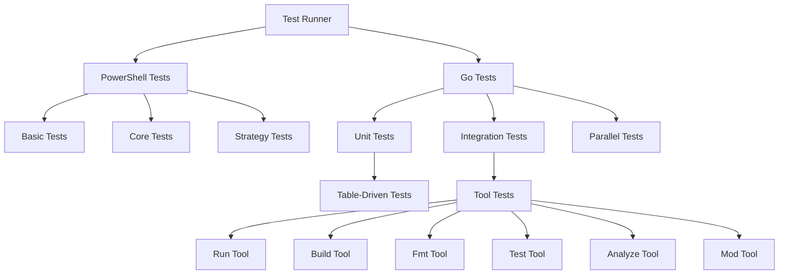
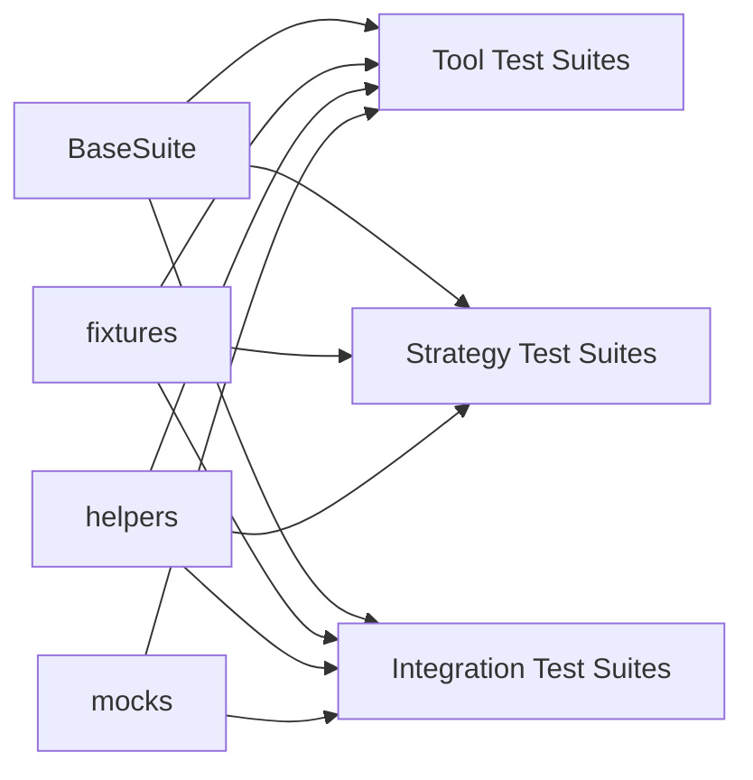
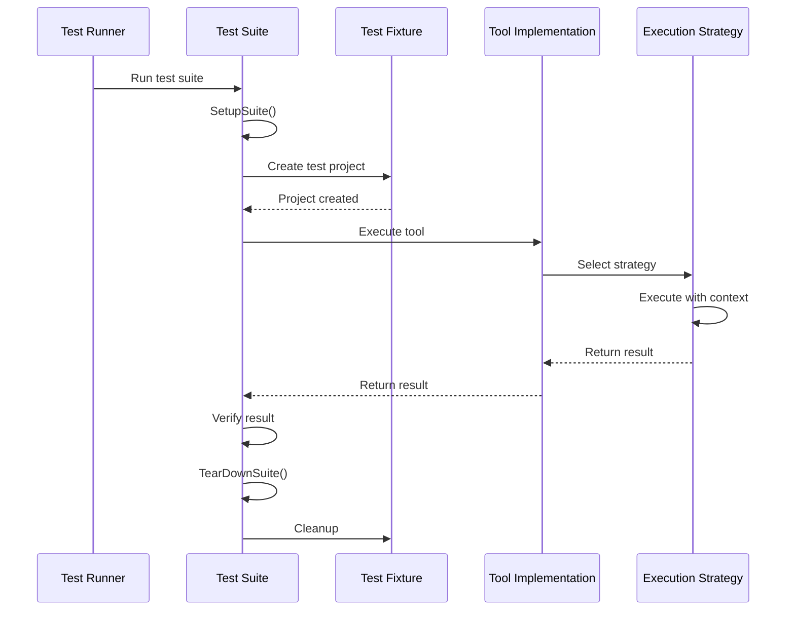

# Go Development MCP Server Testing Architecture

This document describes the testing architecture for the Go Development MCP Server, detailing the relationships between components, test types, and execution patterns.

## Testing Architecture Overview



## Component Relationships

### Test Framework Components



### Test Execution Flow



## Test Strategy

### Unit Testing

Unit tests focus on testing individual components in isolation:

- **Input Parsing**: Testing the parsing of input parameters
- **Strategy Selection**: Testing the correct selection of execution strategies
- **Result Formatting**: Testing the formatting of results

### Integration Testing

Integration tests verify that components work together correctly:

- **Tool Execution**: Testing that tools execute correctly with different inputs
- **Error Handling**: Testing that errors are properly caught and reported
- **Timeouts**: Testing that execution timeouts work correctly

### Parallel Testing

The framework supports parallel test execution:

- **Test Isolation**: Each test operates in its own temporary directory
- **Resource Management**: Careful resource acquisition and cleanup
- **Concurrency Control**: Configurable parallelism levels

## Testing Patterns

### Table-Driven Testing

Table-driven tests allow testing multiple scenarios with the same test code:

```go
testCases := []struct {
    name     string
    input    string
    expected string
}{
    {"case1", "input1", "expected1"},
    {"case2", "input2", "expected2"},
    // ...more cases
}

for _, tc := range testCases {
    // Test logic here
}
```

### BDD-Style Testing

Some tests use a Given/When/Then structure for clarity:

- **Given**: Set up the test conditions
- **When**: Execute the operation being tested
- **Then**: Verify the results

## Test Coverage

The framework includes test coverage measurement:

- **Line Coverage**: Percentage of code lines executed by tests
- **Branch Coverage**: Percentage of code branches executed by tests
- **Function Coverage**: Percentage of functions called by tests

## Migration Strategy

The migration from PowerShell to Go tests follows this pattern:

1. **Parallel Development**: Maintain both test systems during transition
2. **Incremental Migration**: Replace PowerShell tests with Go tests in phases
3. **Feature Parity**: Ensure all functionality tested in PowerShell is covered in Go
4. **Validation**: Verify both test systems give consistent results
5. **Phase Out**: Once Go tests are comprehensive, phase out PowerShell tests

## Testing Best Practices

1. **Deterministic Tests**: Tests should produce the same results every time
2. **Fast Tests**: Tests should run quickly to encourage frequent testing
3. **Independent Tests**: Tests should not depend on each other
4. **Clear Expectations**: Tests should clearly indicate what they're testing
5. **Comprehensive Coverage**: Tests should cover normal and error cases
6. **Maintainable Tests**: Tests should be easy to understand and maintain
